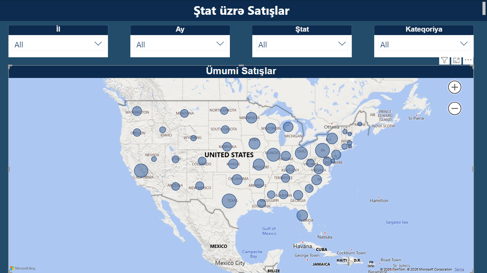
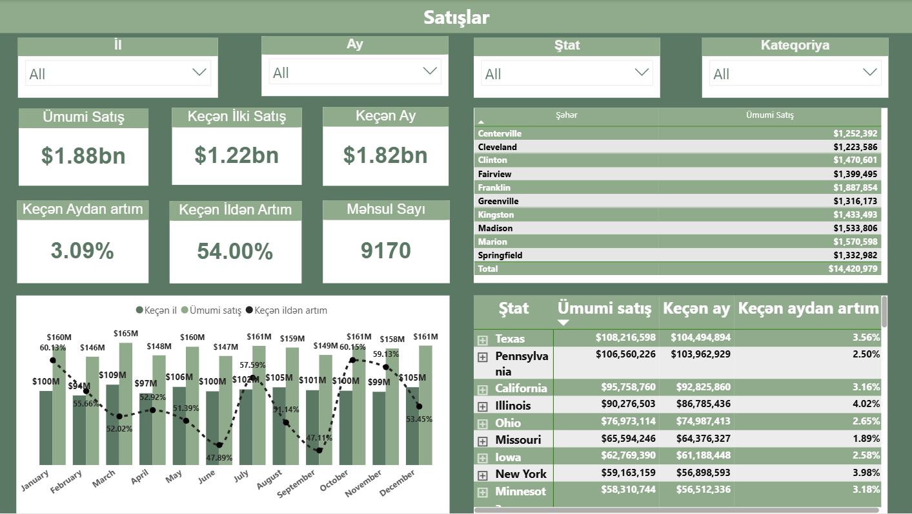
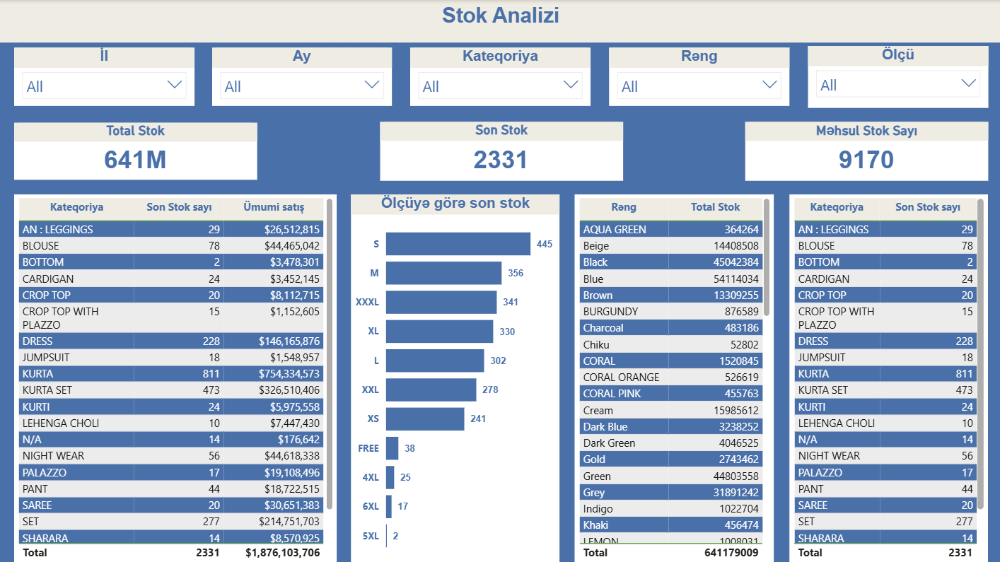
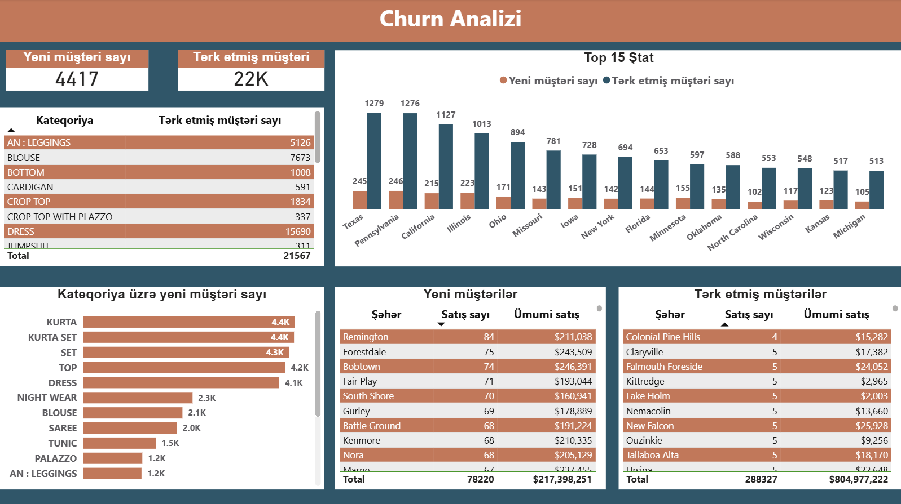

**Bu Power BI layihəsi Amazon satış, stok və müştəri churn məlumatlarının təhlili üçün hazırlanmışdır.** 
**Məqsəd satış trendini, stok vəziyyətini və müştəri itkisinin (churn) vizual şəkildə təqdim etməkdir.**
##  Layihədə yer alan analizlər

- **Satış Analizi (Sales Analysis):** 
  - Əsasən keçən ay və keçən il ilə müqayisə
  - Məhsul və region üzrə satış trendi
  - KPI-lar: ümumi satış, artım/azalma faizi

- **Xəritə Analizi (Geographical Sales):**
  - ABŞ ştatları üzrə satış paylanması

- **Stok Analizi (Stock Analysis):**
  - Total stok və son stok göstəriciləri
  - Məhsul kateqoriyaları üzrə stok səviyyəsi
  - Məhsula  görə total stok

- **Churn Analizi (Customer Churn Analysis):**
  - Müştəri itkisi və retention trendləri
  - Ştatlar üzrə yeni və tərk etmiş müştərilərin sayı
  - Kateqoriya üzrə yeni müştəri sayı

## İstifadə olunan texnologiyalar və addımlar

- **Power BI Desktop** – Dashboard və vizuallaşdırmalar
- **DAX** – Hesablama və KPI-lar
- **GIS/Xəritə vizualizasiya** – Ştatlara görə satışların göstərilməsi
- **Query Editor / Data Preparation** – Raw datanın təmizlənməsi və çevrilməsi
- **Data Model** – Cədvəllərin əlaqələndirilməsi və analitik modelin qurulması
## 📁 Fayllar
- Amazon.pbix – Power BI layihə faylı
- screenshots/ – Dashboard ekran görüntüləri
##  Ekran Görüntüləri

 
   
